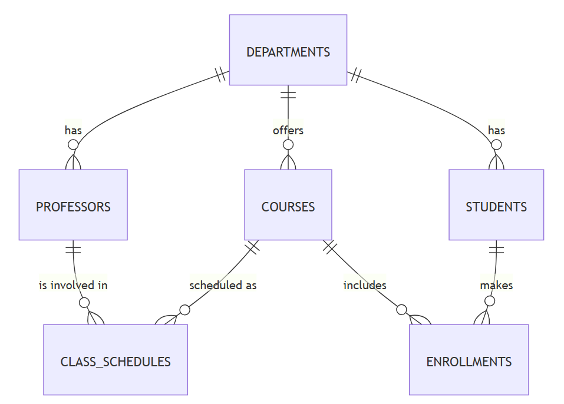

# Design Document

By Yvan Nkondog

Video overview: <[URL HERE](https://github.com/Yvan-Nkondog/HARVARD_CS50_SQL/raw/refs/heads/main/project/CS50_SQL_Final_Project_Overview.odp)>

## Scope

In this section you should answer the following questions:

### What is the purpose of your database?

#### This database has been designed to handle academic institution (university) management. Specifically the database stores information about :
- Students
- Professors
- Courses
- Departements
- Enrollments
- Class schedules

### Which people, places, things, etc. are you including in the scope of your database?

#### The people included in the database are :
- Students : including their first and last names, emails, and department affiliations.
- Professors : including their first and last names, emails, and department affiliations.

#### The places included in the database are :
- Departments : the departments represent the academic divisions of the academic institutions (for example, mathematics department, software engineering department).

#### The things things included in the database are courses, enrollments and class schedules : 
- Courses : used to group a specified workload of material that is taught to students.
- Class schedules : used to represent the link between professors and courses, for a given year and for a given semester.
- Enrollments : used to link students to courses. At the end of each course, a grade (score) is recorded.

### Which people, places, things, etc. are *outside* the scope of your database?

#### The database does not include administrative staff, teaching assistants, alumni, among others, concerning people. The database does not include geographical location (campuses, cities, countries), physical classrooms, lecture halls, among other, concerning places. The database does not include detailed course content (assignments, exams, syllabus), tuition payment, billing, research projects and publications, among others, concerning things.

## Functional Requirements

In this section you should answer the following questions:

### What should a user be able to do with your database?

#### A user should be able to carryout general operations on tables :
- Finding the list of professors in a department (can be filtered if required).
- Finding the list of students in a department (can be filtered if required).
- Finding the list of students enrolled in a specific course (can be filtered if required).
- Finding the grades of students (can be filtered if required).
- Finding the courses offered according to the situation of each student (can be filtered if required).
- Finding class schedules for previous and current semester and year (can be filtered if required).
- Etc.

### What's beyond the scope of what a user should be able to do with your database?

#### The current version of the database does not include the rank of professors and the level of students. Also, the database does not distinguish former students from current students, and former professors from current professors.

## Representation

#### The entities are constructed using SQLite tables. 

### Entities

In this section you should answer the following questions:

* Which entities will you choose to represent in your database?
* What attributes will those entities have?
* Why did you choose the types you did?
* Why did you choose the constraints you did?

### The following schema have been used to construct the entities.

#### Departments
The table `departments` comprises the following attributes :
- `id` : this attribute is the `PRIMARY KEY`, and specifies the unique identification for the table `departments`. The type `INTEGER` has been selected (because `id` values are whole numbers). The `id` is used as `PRIMARY KEY` because it facilitates insertions by auto-incrementing values that are inserted inside the column.
- `name` : this attribute represents the name of the department, hence the `TEXT` type has been used. Note that `TEXT` is the appropriate type to represent sequences of characters and the name of a department is a sequence of characters.

#### Professors
The table `professors` comprises the following attributes :
- `id` : this attribute is the `PRIMARY KEY`, and specifies the unique identification for the table `professors`. The type `INTEGER` has been selected (because `id` values are whole numbers). The `id` is used as `PRIMARY KEY` because it facilitates insertions by auto-incrementing values that are inserted inside the column.
- `first_name` : this attribute represents the first name of the professor, hence the `TEXT` type has been used because `TEXT` is the appropriate type to represent names (sequences characters).
- `last_name` : this attribute represents the last name of the professor. The `TEXT` type has been used for the same reason as it has been used for the first name.
- `department_id` : this attribute represents the department in which the professor works. It is an `INTEGER`, and is obtained from another table, the table `departments`, as a `FOREIGN KEY` to maintain data integrity.
- `email` : represents the electronic mail used to contact the professor. It is of type `TEXT` because it is a sequence of characters. A pattern has been added to ensure the email contains the charachers `@` and `.` in that order, separated, preceded, and followed by some characters (which is the standard pattern used for emails).

#### Course
The table `courses` comprises the following attributes :
- `id` : this attribute is the `PRIMARY KEY`, and specifies the unique identification for the table `courses`. The type `INTEGER` has been selected (because `id` values are whole numbers). The `id` is used as `PRIMARY KEY` because it facilitates insertions by auto-incrementing values that are inserted inside the column.
- `name` : this attribute represents the name of the course, hence the `TEXT` type has been used. Note that `TEXT` is the appropriate type to represent sequences of characters and the name of a course is a sequence of characters.
- `department_id` : this attribute represents the department which offers the course. It is an `INTEGER`, and is obtained from the table `departments` (another table), as a `FOREIGN KEY` to maintain data integrity.
- `credits` : this attribute codifies the expected workload of a course. The higher the number of credits, the higher the expected workload. The type `INTEGER` has been used to represent the number of credits because the credit values of courses are usually whole numbers.

#### Students
The table `students` includes the following attributes :
- `id` : this attribute is the `PRIMARY KEY`, and specifies the unique identification for the table `students`. The type `INTEGER` has been selected (because `id` values are whole numbers). The `id` is used as `PRIMARY KEY` because it facilitates insertions by auto-incrementing values that are inserted inside the column.
- `first_name` : this attribute represents the first name of the student, hence the `TEXT` type has been used because `TEXT` is the appropriate type to represent sequences of characters (a name is a sequence of characters).
- `last_name` : this attribute represents the last name of the student. The `TEXT` type has been used for the same reason as it has been used for the first name.
- `department_id` : this attribute represents the department in which a student is enrolled. It is an `INTEGER`, and is obtained from another table, the table `departments`, as a `FOREIGN KEY` to maintain data integrity.
- `email` : represents the electronic mail used to contact the professor. It is of type `TEXT` because it is a sequence of characters. As for the table `professors`, a pattern has been added to ensure the email contains the charachers `@` and `.` in that order, separated, preceded, and followed by some characters (which is the standard pattern used for emails).

#### Enrollments
The table `enrollments` comprises the following attributes :
- `id` : this attribute is the `PRIMARY KEY`, and specifies the unique identification for the table `enrollments`. The type `INTEGER` has been selected (because `id` values are whole numbers). The `id` is used as `PRIMARY KEY` because it facilitates insertions by auto-incrementing values that are inserted inside the column.
- `student_id` : this attribute represents the `id` of the each student enrolled in a specific course. The attribute is of type `INTEGER` (because it is a whole number), and it is obtained from another table, the table `students`, as a `FOREIGN KEY` to maintain data integrity.
- `course_id` : this attribute represents the `id` of the each course in which students are enrolled. The attribute is of type `INTEGER` (because it is a whole number), and it is obtained from another table, the table `courses`,as a `FOREIGN KEY` to maintain data integrity.
- `grade` : This attribute represents the final 'score' each student obtains at the end of a course. In the current implementation, the `NOT NULL` constraint has not been applied, to take into account students currently taking a course (the `grade` is `NULL` before the end of the course). The type `TEXT` has been used because each `grade` is represented by a letter. A `CHECK CONSTRAINT` has been added to ensure that the `grade` is selected from a predefined set of values.

#### Class_schedules
The table `class_schedules` comprises the following attributes :
- `id` : this attribute is the `PRIMARY KEY`, and specifies the unique identification for the table `class_schedules`. The type `INTEGER` has been selected (because `id` values are whole numbers). The `id` is used as `PRIMARY KEY` because it facilitates insertions by auto-incrementing values that are inserted inside the column.
- `professor_id` : this attribute represents the `id` of the each professor that teaches at least (or has taught at least) one course. The attribute is of type `INTEGER` (because it is a whole number), and it is obtained from another table, the table `professors`, as a `FOREIGN KEY` to maintain data integrity.
- `course_id` : this attribute represents the `id` of the each course offered (or that has been offered) for a given year and for a given semester. The attribute is of type `INTEGER` (because it is a whole number), and it is obtained from another table, the table `courses`,as a `FOREIGN KEY` to maintain data integrity.
- `semester` : This attribute represents the semester during which a given course is taught. In the current iteration, a `CHECK CONSTRAINT` has been added to ensure the semester belongs to a predefined set of values. The type `TEXT` has been used because each predefined `semester` value is a sequence of characters, best represented with `TEXT`.
- `year` : This attribute represents the year in which a course is taught. The type `INTEGER` has been used because the year is a whole number. A `CHECK CONSTRAINT` has been added to ensure that only positive values are added the column years. 

### Relationships

In this section you should include your entity relationship diagram and describe the relationships between the entities in your database.

### Entity-relation diagram
#### The entity-relation diagram below represents the relations between the tables that constitute the database constructed for the project.

### Relations between the entities

#### This section presents the textual description of what is shown in the entity-relation diagram above.
- One department has zero (0) or many professors and each professor works in one and only one department. Usually, a professor is assigned to single department in academic institutions, although it is possible for each professor to collaborate with other departments (especially in research). A department usually contains many professors to teach the various courses and to carryout research activities.
- One department has zero (0) or many students and each student is enrolled in one and only one department. Usually, a student is admitted in a university in a single department. A university has many students, each of these students are grouped into departments (fields of specialization).
- One department offers zero (0) or many courses and each course is offered by one and only one department. In universities and other academic institutions, courses are usually associated to a single departement. Each department usually offers a set of courses for each semester (and for each year).
- One professor is involved into zero (0) or many class schedules and each class schedule is handled by one and only one professor. In certains cases, professors may have actitivities different from standard teaching (for example research, conferences).
- One course is scheduled as (grouped into) zero (0) or many class schedules (depending on the enrollment of students) and each class schedule presents the content of one and only one course. The number of class schedules per course usually depends on the number of students enrolled in the course, the capacity (size) of the classrooms, etc.
- One student can make zero (0) or many enrollments into courses and each enrollment into a course corresponds to one and only one student. Most students (full time) make multiple enrollments into courses. It is however possible that a student does not enroll during certain semesters.
- One course includes zero (0) or many enrollments and each enrollment corresponds to one and only one course. The number of enrollments in a course corresponds to the number of students that are part of that course. Note that it is possible for some courses to have no enrollment during certain semesters and certain years.

## Optimizations

In this section you should answer the following questions:

### Which optimizations (e.g., indexes, views) did you create? Why?

### Indexing has been used as source of optimization for this project. Columns of queries that have been identified as (potentially) regularly used have been indexed:

- The `INDEX` `"professor_name_search" ON "professors" ("first_name", "last_name")` has been added to handle common searches of professors by first name and last name, which is usually common. An example of such a query is presented in the file queries.sql. The index is used in this case as a filter and permits to avoid complete scanning of rows.

- The `INDEX` `"student_name_search" ON "students"("first_name", "last_name")` has been added to handle common searches of students by first name and last name, which is usually common. An example of such a query is presented in the file queries.sql. This index is used in exactly the same way as the index described in the previous paragraph, for `professors`.

- The `INDEX` `"course_credit_search" ON "courses"("credits")` has been added to handle common searches which concern number of credits per course. This kind of searches are regular in many cases, for example, when students select courses to enroll for a given semester (knowing that universities usually impose bounds on number of credits each student can take per semester). An example of such a query is presented in the file queries.sql.

- The `INDEX` `"class_schedule_year_semester_search" ON "class_schedules"("year", "semester")` has been added to handle common searches to know the professors that teach courses for a given `year` and for a given `semester`. An example is a professor checking the courses (s)he has been assigned to, by the academic institution for a given year and / or for a given semester (all professors usually check this information). An example of such a query is presented in the file queries.sql.

## Limitations

In this section you should answer the following questions:

* What are the limitations of your design?
* What might your database not be able to represent very well?

#### The table `enrollments` is currently linked to the table `class_schedules` using only the attribute `course_id`, that is, through the table `courses`. Adding an attribute `class_schedules_id` to the table  `enrollments`, for example, should make it possible to track specific instances of the table `class_schedules` rather than just a course. 

#### Also, it is possible to implement many-to-many relations. For example, in certain universities, it is possible for students to enroll into different programs (at the same time), thus be part of many departments (at the same time). A many-to-many relation between students and departments is thus possible. The current design does not take into account this many-to-many relations.